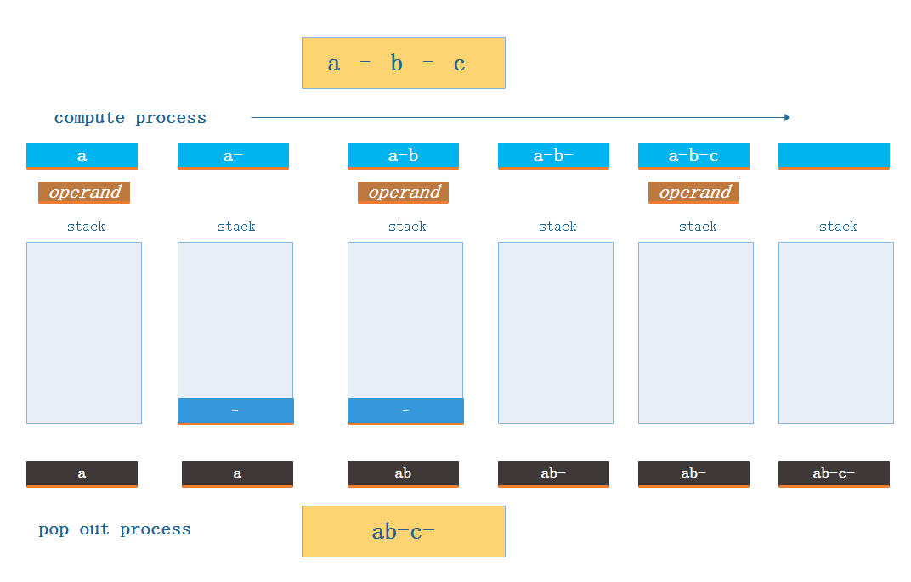
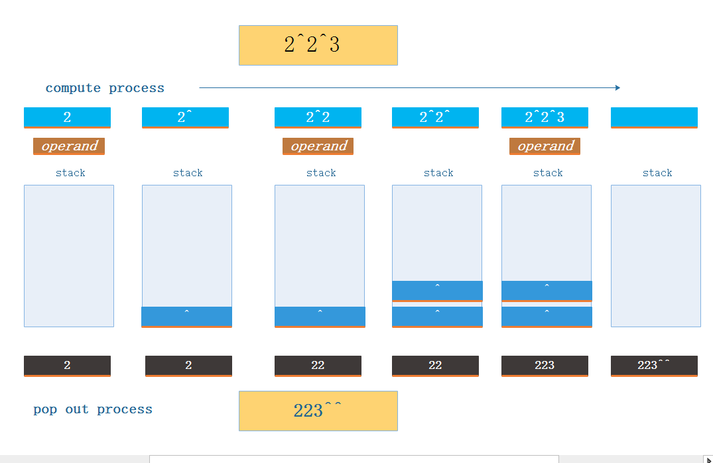

### Using Stack to animate the conversion from infix to postfix

#### name: Zhou Heng (周恒)
#### studentID: 11510629

***

> a – b – c to postfix:

>  a b - c -

> 2 ^ 2 ^ 3 to postfix:

>  2 2 3 ^ ^

